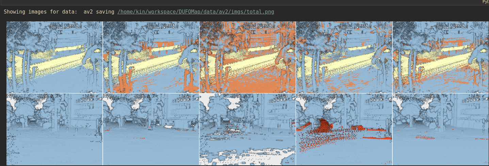
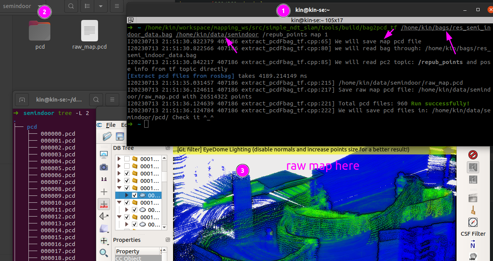
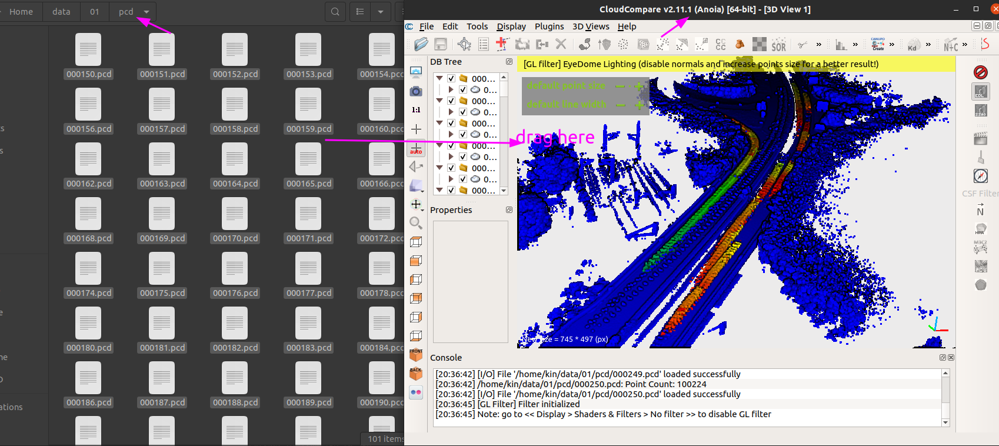
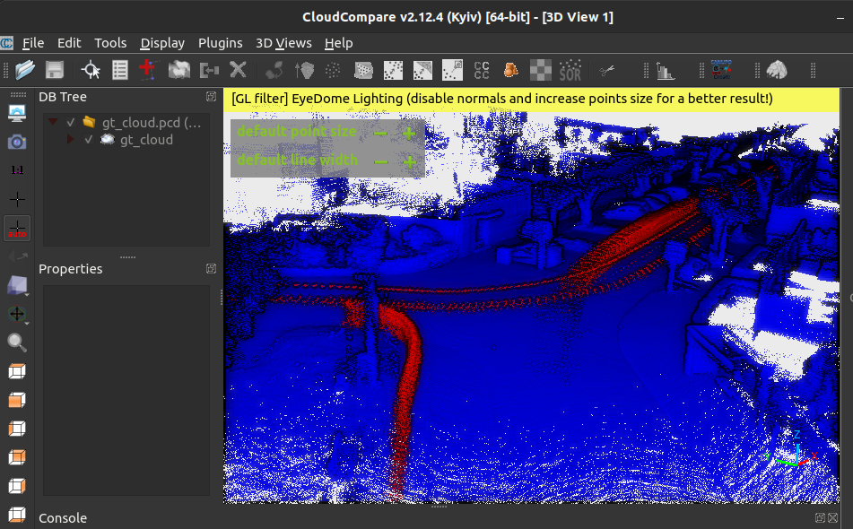

Create/Evaluation Data
---

- Create the data you need for the unified benchmark. But I will recommend to download directly from link, then we don't need to read <u>Data Creation</u>. Most important reason is Data Creation don't include manually labeled ground truth file.

  It will also help if you want to create your own dataset for benchmarking. Welcome to contribute your dataset to the community.
- Evaluate the performance of the methods. 
- **Compare the result** and **output the visualization** automatically.

It's better to view this `md` file through outline. No need to go through all of them. 😃

## Evaluation

This part include output the quantitative table and qualitative result automatically. To be updated scripts....

All the methods will output the **clean map**, so we need to extract the ground truth label from gt label based on clean map. Why we need this? Since maybe some methods will downsample in their pipeline, so we need to extract the gt label from the downsampled map.

### 0. Create the eval data
```bash
# Check export_eval_pcd.cpp
./export_eval_pcd [folder that you have the output pcd] [method_name_output.pcd] [min_dis to view as the same point]

# example:
./export_eval_pcd /home/kin/bags/VLP16_cone_two_people octomapfg_output.pcd 0.05
```

### 1. Print the score
Check the script and the only thing you need do is change the folder path to your data folder. Or downloaded the result data to test if you want.
```bash
python3 evaluate_benchmark_all_pts.py
```

### Optional: Create the visualization

Make sure you have the `gt_cloud.pcd`, `method_output.pcd` and `method_output_exportGT.pcd` which produced by above part.

Since you may wonder what's mistake happened in each methods, label with different intensity to view in CloudCompare. Check `view_maps.ipynb`. 

<!--  -->

## Data Creation

We provided scripts to extract data from KITTI and Argoverse 2.0. Importantly, you can always run them on your custom dataset collected by yourself. Every folder we extract or process have unified format with PCD files have point cloud data and pose in `VIEWPOINT` filed, and folder tree like this:
```bash
├── 00 # KITTI sequence 00
│   ├── gt_cloud.pcd
│   ├── pcd
│   │   ├── 004390.pcd
│   │   ├── 004391.pcd
│   │   ├── ....

├── semindoor # semi-indoor
│   ├── gt_cloud.pcd # I manually labeled this for getting quantitative result
│   ├── pcd
│   │   ├── 000001.pcd
│   │   ├── 000002.pcd
│   │   ├── ....
```

### Custom Dataset

For our custom dataset, we normally record the pointcloud with rosbag, and then running some slam methods to get the pose. If you don't have clue to use the slam package, check [simple_ndt_slam](https://github.com/Kin-Zhang/simple_ndt_slam) repo the only dependence you need in the repo is ROS. If you don't have ROS/Ubuntu, you can directly use the `docker` to run.

Then, directly export rosbag file [which have pose/tf and pointcloud topic] to pcd we want, after your run with [`simple_ndt_slam`](https://github.com/Kin-Zhang/simple_ndt_slam) check your result rosbag file by `rosbag info`, here is example output:
```bash
➜  bags rosbag info res_semi_indoor_data.bag
path:        res_semi_indoor_data.bag
version:     2.0
duration:    1:47s (107s)
start:       Apr 28 2023 11:11:26.79 (1682673086.79)
end:         Apr 28 2023 11:13:14.35 (1682673194.35)
size:        810.8 MB
messages:    4803
compression: none [961/961 chunks]
types:       nav_msgs/Odometry       [cd5e73d190d741a2f92e81eda573aca7]
             sensor_msgs/PointCloud2 [1158d486dd51d683ce2f1be655c3c181]
             tf2_msgs/TFMessage      [94810edda583a504dfda3829e70d7eec]
topics:      /auto_odom       960 msgs    : nav_msgs/Odometry      
             /repub_points    960 msgs    : sensor_msgs/PointCloud2
             /tf             2883 msgs    : tf2_msgs/TFMessage

```

Then use the scripts I provided in [`simple_ndt_slam`](https://github.com/Kin-Zhang/simple_ndt_slam) to extract the pcd data to unified format here.

```bash
roscore # since need read rosbag through scripts

/home/kin/workspace/mapping_ws/src/simple_ndt_slam/tools/build/bag2pcd_tf /home/kin/bags/res_semi_indoor_data.bag /home/kin/data/semindoor /repub_points map 1 # 1 for save raw map also since some methods need use it in the framework.
```

Demo Screenshot:


### Open-source Dataset

This part is for open-source dataset, include SemanticKITTI and Argoverse2.0.

#### KITTI / SemanticKITTI

Official data format [Download link](http://www.semantic-kitti.org/dataset.html#download)

##### A.1 Extract Point Cloud Data

extract the semantic-kitti dataset from the raw data, when you download the original SemanticKITTI dataset, you will get a folder like this:
```
➜  SemanticKitti tree -L 2
.
├── data_odometry_calib
│   └── dataset
│       └── sequences
├── data_odometry_labels
│   ├── dataset
│   │   └── sequences
│   └── README
├── data_odometry_velodyne
│   └── dataset
│       └── sequences
```

Modified the `ORIGIN_PATH` in [extract_semkitti.py](py/data/extract_semkitti.py), then run the script:
```
python3 scripts/extract_semkitti.py
```

Note!! 

1. We keep poses as SemanticKITTI gt one some package may change to hard. We keep it as official dataset.
2. You can get the sensor pose in the PCD VIEWPOINT Field, so you don't need pose file etc. If you are using CloudCompare to view, drag all pcd files to windows, you will have the correct whole map view. (NOTE Since we already transform to world frame CloudCompare in 2.11 version will looks correct map but version to 2.12+ will have double effect on VIEWPOINT Field [you can comment the transform line if you don't like that.] )
	
	Example here:
	

##### A.2 Export Ground Truth

Need install C++ dependencies in main README

```bash
cd DynamicMap_Benchmark/scripts
cmake -B build && cmake --build build 
➜  scripts git:(master) ✗ ./build/extract_gtcloud /home/kin/data/00/pcd
I20230628 10:29:03.206132 15928 extract_gtcloud.cpp:42] No downsample flag, set to 0, save all points
I20230628 10:29:03.889710 15928 extract_gtcloud.cpp:152] gt_cloud saved to /home/kin/data/00/gt_cloud.pcd Check file there
[extract_gtcloud] takes 683.485297 ms
```

View the ground truth in CloudCompare, intensity=1 means dynamic which are red points in images:



#### Argoverse 2.0

I manually labeled dynamic and static in one sequence folder name: `07YOTznatmYypvQYpzviEcU3yGPsyaGg__Spring_2020` , you have to go for website to downloaded this ground truth PCD.

##### B.1 Download the Argoverse dataset

Check this issue: https://github.com/argoverse/av2-api/issues/161

Installing s5cmd

```bash
#!/usr/bin/env bash

export INSTALL_DIR=$HOME/.local/bin
export PATH=$PATH:$INSTALL_DIR
export S5CMD_URI=https://github.com/peak/s5cmd/releases/download/v1.4.0/s5cmd_1.4.0_$(uname | sed 's/Darwin/macOS/g')-64bit.tar.gz

mkdir -p $INSTALL_DIR
curl -sL $S5CMD_URI | tar -C $INSTALL_DIR -xvzf - s5cmd
```

Download the val dataset since train is toooo big for me, totally is 5T for train dataset although no label.

```bash
s5cmd --no-sign-request cp 's3://argoai-argoverse/av2/lidar/val/*' /home/kin/bags/av2/val
```

##### B.2 Extract Point Cloud Data

This time no need cpp file since argoverse have their own api things and we just need to use it. Also I write with save pcd in utils.

Check their [python api](https://pypi.org/project/av2/), [github](https://github.com/argoverse/av2-api)
```bash
pip install av2
```

Please check the folder path inside the script.
```bash
python3 scripts/extract_argoverse2.py
```


## Other Tools

- [CloudCompare](https://www.danielgm.net/cc/) view pcd tools and make animation video.
    ```bash
    flatpak install flathub org.cloudcompare.CloudCompare
    ```
    I also used to label this tool for ground truth: Dynamic and Static points, only for quantitative result.
